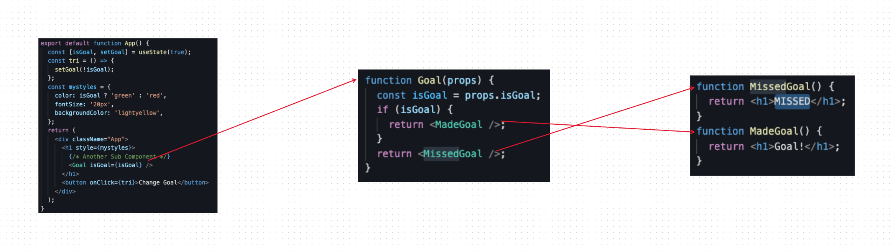

# React Conditional Rendering
## `if` Statement
we can use `if` javascript operator to decide which component to render
```javascript
function MissedGoal() {
    return <h1>MISSED</h1>
}
function MadeGoal() {
    return <h1>Goal!</h1>
}

function Goal(props) {
    const isGoal = props.isGoal;
    if (isGoal) {
        return <MadeGoal />
    }
    return <MissedGoal />
}
```



## Logical `&&` Operator

```javascript

function Car(props) {
  return <>{props.brand && <h1>My car is a {props.brand}</h1>}</>;
}
<Car brand="Honda" />
```

## Ternary Operator 
```javascript
function Goal(props) {
    const isGoal = props.isGoal;
    return (
        <>
        {isGoal ? <MadeGoal /> : <MissedGoal />}
        </>
    )
}
```